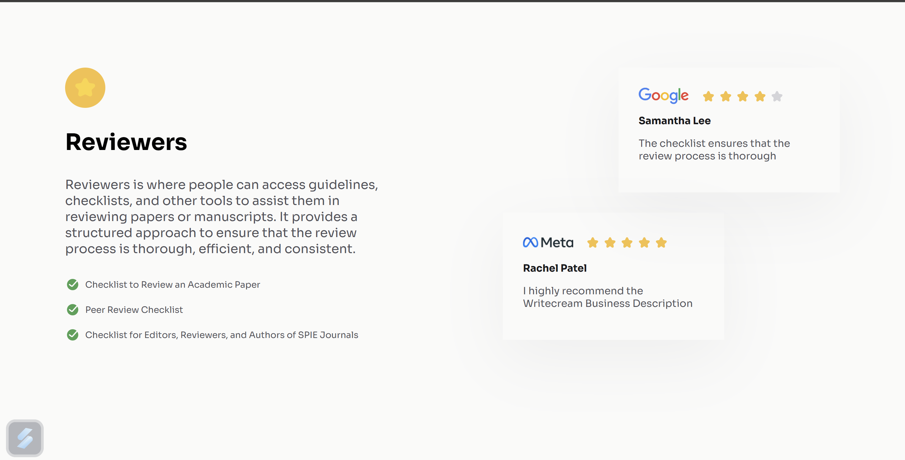

# Testimonial Page

This project is a simple, responsive testimonial page designed to display various reviews along with company logos and star ratings. The page is structured with HTML and styled using CSS. It's mobile-first and adapts to different screen sizes.

## 🖥️ Features
- **Responsive Design**: Responsive design for various screen sizes (Desktop, Tablet, and Mobile).
- **Modern Styling**: Utilizes Google Fonts for typography.
- **Flexbox Layout**: Ensures proper alignment and spacing.

## 🛠️ Technologies Used
- **HTML5**: Markup structure.
- **CSS3**: Styling and layout.
- **Google Fonts**: Custom fonts for typography (Poppins, Inter, and Sora).

## 🏗️ Project Structure
```
testimonialPage/
|
+-- resources          # resources for webpage
+-- index.html         # Main HTML file
+-- styles.css         # CSS file for styling
\-- README.md          # Documentation (this file)
```

## 🚀 How to Use
1. Clone the repository:
   ```bash
   git clone https://github.com//testimonialPage.git 
2. Open the `index.html` file in your favorite browser.

## 📂 Folder Structure
- index.html: Contains the HTML structure of the testimonial page.
- style.css: Provides the CSS styling, flexbox-based layout, and media query.
- resources/: Folder for assets like images and icon.

## 📝 Customization
- Update structure in the `index.html` file.
- Adjust colors, font sizes, or layout in the style.css file.

## 🖼️ Screenshot


